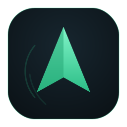
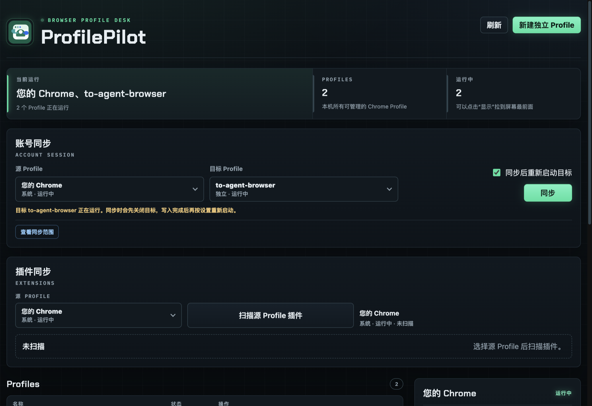
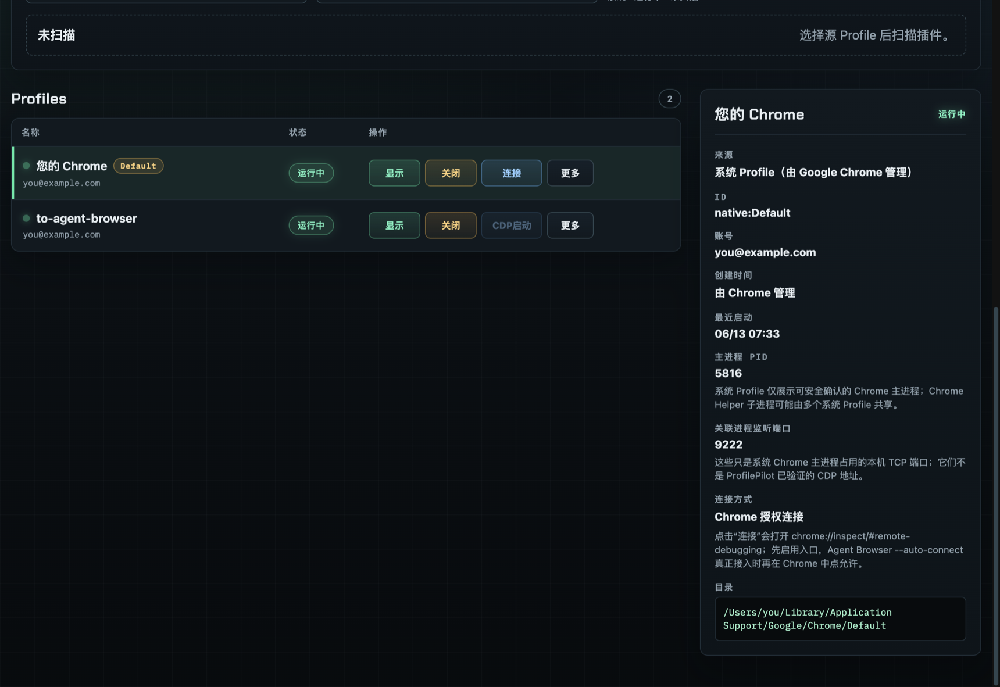

<div align="center">
  
  <h1>ProfilePilot</h1>
  <p><b>本机优先的 Chrome Profile 控制台</b></p>
  <p>管理真实的 Chrome Profile，创建隔离测试环境，迁移扩展与登录态，<br/>再把一个干净、可控的浏览器交给 Agent 或人工测试。</p>

  <p>
    <a href="https://github.com/ffffhx/profilepilot/releases/latest"></a>
    
    <a href="LICENSE"></a>
    <a href="https://ffffhx.github.io/profilepilot/"></a>
  </p>

  <p>
    <a href="https://github.com/ffffhx/profilepilot/releases/latest/download/ProfilePilot-mac-arm64.dmg"><b>下载 macOS 版</b></a> ·
    <a href="#-安装">更多下载</a> ·
    <a href="https://ffffhx.github.io/profilepilot/">官网</a>
  </p>
</div>

---

<div align="center">
  
  <br/><br/>
  
</div>

## ✨ 这是什么

ProfilePilot 是一个**本机优先（local-first）**的桌面工具，给你日常在用的真实 Chrome 补上一块缺失的控制面。

它把 Chrome 自己的 Profile 当作**一等公民**：从 Chrome 的 `Local State` 里发现 `Default` / `Profile N`，统一管理它们的启动、显示、关闭与重命名；同时支持创建用独立 `--user-data-dir` 隔离的测试 Profile，把扩展和登录态在 Profile 之间迁移、同步，并为 Agent 自动化提供可控的 CDP 入口。

> [!NOTE]
> **ProfilePilot 不是反检测浏览器。** 它不伪装指纹、不做云端隔离，而是站在你已经使用的真实 Chrome 数据之上工作，保留浏览器的真实性和本机可解释性。如果你需要的是指纹伪装或规模化养号，这个工具不适合你。

## 🎛 核心能力

| 能力 | 说明 |
| --- | --- |
| 🗂 **原生 Profile 管理** | 发现、重命名、启动、显示到最前、关闭、安全删除 Chrome 自带的 Profile；默认 Profile 受保护、不会被误删 |
| 🧪 **隔离测试 Profile** | 用独立 `--user-data-dir` 创建干净环境，适合 QA、Agent、临时账号验证，与你的主 Profile 完全隔离 |
| 🔄 **账号会话同步** | 把源 Profile 的登录态（Cookies、Local/Session Storage、IndexedDB、账号与同步数据等）复制到目标 Profile，带变更预览、暂停 / 取消、覆盖前自动备份 |
| 🧩 **扩展扫描与迁移** | 识别扩展来源（Web Store / 本地 / Profile 内）、版本和数据目录，按浏览器界面语言显示扩展名称，迁移前为目标创建备份 |
| 🤖 **CDP 自动化入口** | 隔离 Profile 可带 remote debugging 端口启动，并验证端口可达，给 Agent / Browser 工具直接接管 |
| 🔌 **连接已运行的系统 Chrome** | 为系统 Profile 打开 Chrome 的远程调试入口，授权后供自动化工具连接 |
| 👁 **外部 Chrome 实例** | 只读列出由其他工具（agent-browser 等）自管的 Chromium 实例，识别无头实例与 CDP 端口，可显示 / 关闭 |
| ♻️ **备份与回滚** | 迁移扩展、同步账号前自动留存目标快照，失败时尽量回滚到安全状态 |

## 🧭 典型场景

- **开发调试** —— 在隔离 Profile 里复现问题，不污染日常浏览器。
- **账号回归** —— 把主账号的登录态同步到测试 Profile，验证完即弃。
- **扩展 QA** —— 扫描、迁移扩展到干净环境逐一验证。
- **Agent 浏览器** —— 同步登录态到独立 Profile，以 CDP 模式启动，交给 agent-browser 等工具自动化。

## 📦 安装

直接下载打包好的安装包：

| 平台 | 架构 | 下载 |
| --- | --- | --- |
| macOS | Apple Silicon | [ProfilePilot-mac-arm64.dmg](https://github.com/ffffhx/profilepilot/releases/latest/download/ProfilePilot-mac-arm64.dmg) |
| macOS | Intel | [ProfilePilot-mac-x64.dmg](https://github.com/ffffhx/profilepilot/releases/latest/download/ProfilePilot-mac-x64.dmg) |
| Windows | x64 | [ProfilePilot-win-x64.exe](https://github.com/ffffhx/profilepilot/releases/latest/download/ProfilePilot-win-x64.exe) |
| 全部文件 | — | [Releases](https://github.com/ffffhx/profilepilot/releases/latest) |

> [!IMPORTANT]
> 当前安装包**尚未做 Apple / Windows 代码签名与公证**。macOS 首次打开若提示「已损坏，无法打开」，这是 Gatekeeper 对未签名应用的拦截。确认安装包来自上面的 Release 后，在终端执行：
> ```bash
> xattr -dr com.apple.quarantine /Applications/ProfilePilot.app
> ```

### 平台支持

| 功能 | macOS | Windows |
| --- | :---: | :---: |
| Profile 管理 / 创建 / 启动 / 删除 | ✅ | ✅ |
| 账号同步 / 扩展迁移 / 备份回滚 | ✅ | ✅ |
| 运行状态检测、窗口「显示」、外部实例检测 | ✅ | ⚠️ 受限 |

> macOS 功能最完整。窗口「显示」、运行状态与外部实例检测依赖 macOS 的系统接口（`ps` / AppleScript / LaunchServices），在 Windows 上为实验性或暂不可用。

### 从源码运行

```bash
npm install
npm start
```

会编译 TypeScript 源码并打开 Electron 应用。需要 **Node.js ≥ 20**。

## 🔒 数据与安全

会话数据很敏感，所以每一步都尽量做到可见、可撤回：

- **本机优先** —— 不强制云同步、不依赖团队体系，数据都在你本机。
- **先关闭，再写入** —— 同步 / 迁移到正在运行的目标 Profile（以及同步扩展数据时正在运行的源 Profile）会先征得确认、关闭它再写入，避免 Chrome 运行时数据库写入造成不一致；写入完成后自动重新启动。
- **优雅关闭，保住登录态** —— 关闭系统 Chrome 时优先走优雅退出（macOS 上等同 ⌘Q），并留足落盘时间，让 Cookies / 登录态正常写入、合并，避免强杀打断写入导致同步后掉登录。
- **先备份，再覆盖** —— 扩展迁移和账号同步都会给目标 Profile 创建可恢复快照。
- **路径透明** —— 数据目录、Profile 目录、备份目录都在界面和本文档中可查。

## ❓ 常见问题

<details>
<summary><b>和反检测 / 指纹浏览器（GoLogin、AdsPower、Multilogin）有什么区别？</b></summary>

那些工具的核心是指纹伪装、代理和规模化运营。ProfilePilot 反过来——**不伪装指纹**，保留真实 Chrome 和本机可解释性，专注把本机 Chrome 数据的扫描、迁移、同步、回滚做扎实。
</details>

<details>
<summary><b>能用 Agent 直接调试我的「默认 Profile」吗？</b></summary>

不能在默认数据目录上直接开 CDP——从 Chrome 136 起，默认 `user-data-dir` 会**静默拒绝** `--remote-debugging-port`（不绑定端口、也没有授权弹窗）。正确做法是用「账号同步」把登录态复制到一个**独立 Profile**，再对它「CDP 启动」，然后让 agent-browser 等工具连接它——这和 agent-browser 自己的做法本质一致（独立 `user-data-dir` + 调试端口）。
</details>

<details>
<summary><b>管理的数据存在哪里？</b></summary>

macOS 上默认存放于：
```text
~/Library/Application Support/ProfilePilot
```
若本机存在历史目录，会继续兼容读取：
```text
~/Library/Application Support/Codex Chrome Profile Manager
```
可用环境变量覆盖：`CPM_DATA_DIR=/path/to/data npm start`
</details>

<details>
<summary><b>为什么提示未签名 / 已损坏？</b></summary>

这是自用测试版的现状——安装包还没有 Apple Developer ID 签名和公证。按上面「安装」一节的 `xattr` 命令解除隔离即可。面向普通用户的正式版本应完成代码签名与公证。
</details>

## 🛠 开发

```bash
npm run check      # 类型检查（tsc --noEmit）
npm run build      # 编译到 dist/
npm start          # 构建并启动应用
npm run site       # 本地预览官网
```

本地打包：

```bash
npm run dist:mac   # macOS（dmg + zip，arm64 / x64）
npm run dist:win   # Windows（nsis + zip，x64）
```

源码结构：

```text
src/
├─ main/         Electron 主进程与本机 Profile 管理逻辑
├─ preload.ts    通过 contextBridge 向渲染层暴露安全的桌面 API
├─ renderer/     渲染层 UI（原生 TS，无框架）
└─ shared/       主进程与渲染层共享的类型和 IPC 通道定义
```

常用环境变量：

| 变量 | 作用 |
| --- | --- |
| `CPM_DATA_DIR` | 覆盖管理数据的存放目录 |
| `CHROME_APP_NAME` | 指定要启动的 Chrome 应用名（如 `Google Chrome Canary`） |
| `CHROME_BINARY` | 直接指定 Chrome 可执行文件路径 |

### 发布流程

由 `.github/workflows/release.yml` 自动完成：

- 推送到 `main` → 构建三平台安装包，发布到滚动的 `latest` release（官网下载链接指向它）。
- 推送 `v*.*.*` 标签 → 发布对应版本的 release。
- 手动触发默认发布到 `latest`，也可指定其它标签。

官网由 `.github/workflows/deploy-pages.yml` 部署到 GitHub Pages。

## 📄 License

[MIT](LICENSE) © ffffhx
