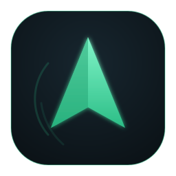
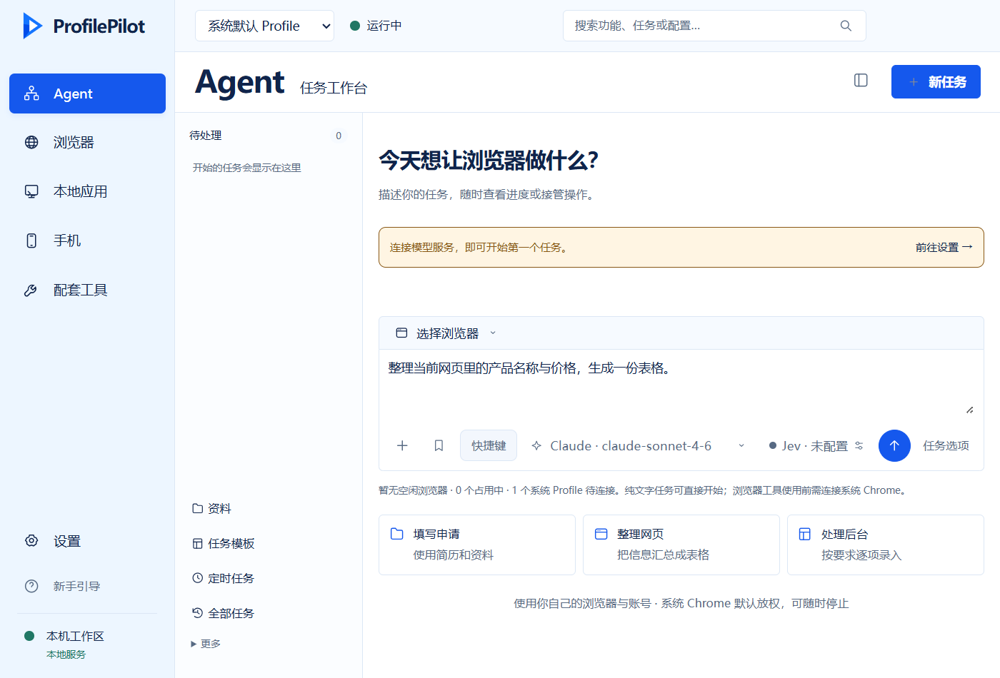
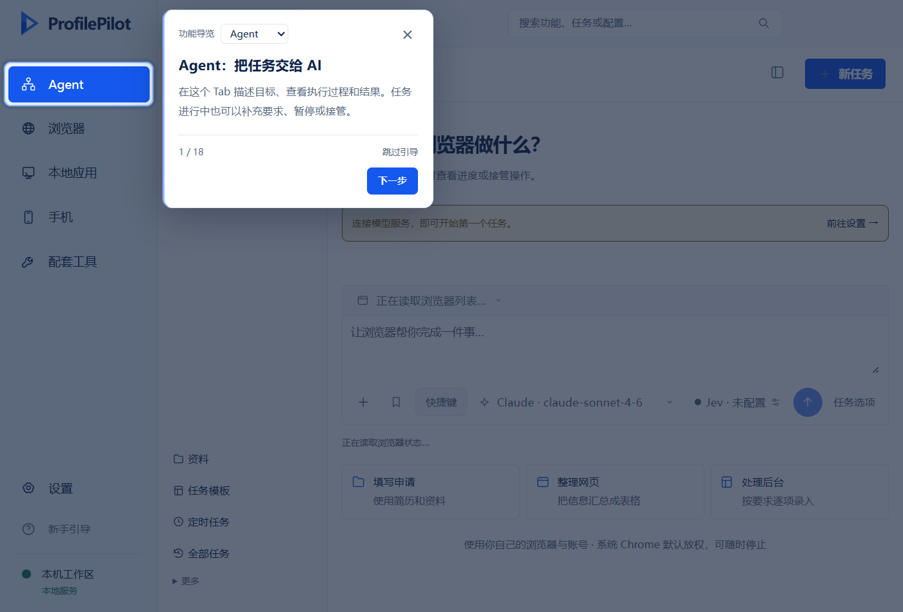

<div align="center">
  
  <h1>ProfilePilot</h1>
  <p><b>让 AI 使用你已登录的浏览器，连接本地应用与 Android 手机</b></p>
  <p>在一个工作区里发起任务、管理浏览器环境、跟进执行结果。<br/>随时暂停或接管，也能从终端和手机继续处理任务。</p>
  <p>Your AI workspace for signed-in browsers, local apps, and Android.</p>
  <p>
    <a href="https://github.com/ffffhx/profilepilot/releases/latest"></a>
    
    <a href="LICENSE"></a>
    <a href="https://github.com/ffffhx/profilepilot/stargazers"></a>
  </p>
  <p>
    <a href="https://github.com/ffffhx/profilepilot/releases/latest"><b>下载桌面版</b></a> ·
    <a href="#第一次使用">快速上手</a> ·
    <a href="https://ffffhx.github.io/profilepilot/">官网</a> ·
    <a href="https://github.com/ffffhx/profilepilot/issues">反馈问题</a>
  </p>
</div>

<p align="center">
  
</p>

## 可以用它做什么

- **让 AI 在日常 Chrome 中完成任务**：通过浏览器扩展沿用已有账号和标签页，整理网页信息、处理表单或检查页面。
- **准备独立的浏览器环境**：创建隔离 Profile，管理扩展、同步账号数据，并在迁移前保留备份，用于开发、测试或其他账号。
- **管理本地项目**：集中启动开发项目和后台服务，查看端口与日志；连接支持调试的 Electron 应用。
- **连接 Android 手机**：通过 USB 或 Wi-Fi 建立查看、控制会话；也可以在手机上向电脑发任务、查看结果和处理确认。
- **接入外部 Agent 或终端**：使用 `ppilot browser`、`ppilot phone` 和配套 Skill；直接运行 `ppilot` 也能与内置 Agent 连续对话。

ProfilePilot 以本机的浏览器、项目和设备为工作环境。你可以使用内置 Agent，也可以只使用管理界面和直接控制工具；内置 Agent 需要配置模型服务。

## 第一次使用

1. **安装并打开桌面版**，或按下方说明从源码运行。
2. **连接浏览器**：进入「配套工具」，选择平时使用的 Chrome Profile，点击「安装并连接」，按提示完成扩展安装与连接。开发版可能需要在 Chrome 中加载已解压的扩展，详见[连接指南](docs/system-chrome-onboarding.md)。
3. **配置模型**：打开左下角「设置」，填写要使用的模型服务。模型调用使用你配置的服务及其额度。
4. **开始任务**：回到「Agent」，确认任务输入区的 Profile，描述目标，例如「整理当前网页里的产品名称与价格，生成表格」。

首次打开会出现**逐步高亮的新手引导**：实际切换 Tab，框住对应按钮或内容，在旁边解释用途。支持上一步、下一步、章节跳转与跳过，之后可从左下角「新手引导」重新打开。浏览引导不会提交任务或点击安装按钮，退出时返回原 Tab 并保留任务草稿。

<p align="center">
  
</p>

## 五个 Tab 分别做什么

| Tab | 用途 | 从哪里开始 |
| --- | --- | --- |
| **Agent** | 创建和继续 AI 任务，查看过程与结果，管理资料、任务模板和定时任务 | 新建任务 → 选择 Profile → 描述目标 |
| **浏览器** | 管理日常 Chrome 与独立 Profile，查看运行、连接、账号和扩展状态 | 选择已有 Profile，或新建独立 Profile |
| **本地应用** | 管理开发项目、Electron 应用和后台服务，查看启动状态与日志 | 添加项目目录和启动命令 |
| **手机** | 连接 Android、查看授权与控制状态；连接移动版管理电脑任务 | USB / Wi-Fi 连接，或「设备设置 → 用手机管理电脑任务」 |
| **配套工具** | 安装浏览器扩展、CLI 与 Agent 使用指引，编辑浏览器和手机控制偏好 | 先连接扩展；需要外部 Agent 时再安装 CLI |

切换 Tab 会保留已打开页面的状态。模型配置位于左下角「设置」。

### 两种浏览器用法

| 场景 | 连接方式 |
| --- | --- |
| 使用已登录的日常 Chrome | ProfilePilot 扩展连接本机浏览器服务，沿用现有页面和账号 |
| 开发、测试或独立账号 | 创建独立 Profile，通过受管理的浏览器 / CDP 入口操作，按需同步账号数据与扩展 |

系统 Chrome 的默认连接路径使用扩展。独立 Profile 使用自己的数据目录。账号同步、扩展迁移和备份功能仍然保留；ProfilePilot 不提供指纹伪装或反检测功能。

### 终端与外部 Agent

在「配套工具」安装 **ProfilePilot CLI**，命令工具和配套 Skill 一起安装与更新。新开终端后：

```sh
ppilot                       # 与内置 Agent 连续对话
ppilot browser status        # 查询浏览器连接
ppilot phone list            # 查看手机设备
ppilot list --json           # 查看任务记录
```

也可以提交任务并跟进结果：

```sh
ppilot run --profile "工作 Profile" "整理当前网页中的产品信息" --follow
```

直接浏览器、手机控制命令本身不调用模型；Agent 对话与任务命令使用应用中配置的模型。控制会话遵守占用、暂停和人工接管状态。详细用法见 [Agent CLI](docs/agent-cli.md)、[浏览器控制 CLI](docs/native-control-cli.md)和 [Android 手机](docs/android-phone.md)。

### Android 与移动任务

Android 配套 App 支持 **Android 11 及以上**，有两条独立的使用路径：

- **电脑查看或控制手机**：通过 USB 或 Wi-Fi 连接，按手机系统提示授予所需权限。屏幕画面按需采集，手机端也能暂停或结束会话。
- **手机管理电脑任务**：配对电脑后发任务、查看进度和结果、回答问题及确认操作。电脑需要保持运行，手机需要能访问电脑；这条路径不要求手机控制用的无障碍权限。

Android 目前提供源码和开发用 debug APK 构建，尚无 iOS 版本或应用商店发行版。构建与配对见 [Android 手机](docs/android-phone.md)和[移动工作区](docs/mobile-workspace.md)。可选的[手机状态同步](docs/phone-status-sync.md)使用 HTTPS 服务传递设备诊断状态，不代替控制连接。

## 安装

| 平台 | 架构 | 下载 |
| --- | --- | --- |
| macOS | Apple Silicon | [ProfilePilot-mac-arm64.dmg](https://github.com/ffffhx/profilepilot/releases/latest/download/ProfilePilot-mac-arm64.dmg) |
| macOS | Intel | [ProfilePilot-mac-x64.dmg](https://github.com/ffffhx/profilepilot/releases/latest/download/ProfilePilot-mac-x64.dmg) |
| Windows | x64 | [ProfilePilot-win-x64.exe](https://github.com/ffffhx/profilepilot/releases/latest/download/ProfilePilot-win-x64.exe) |
| 全部文件 | — | [Releases](https://github.com/ffffhx/profilepilot/releases/latest) |

本 README 描述 `main` 分支的功能。安装包由维护者单独构建发布，可能落后于源码；体验最新改动可从源码运行。

> [!IMPORTANT]
> 当前安装包尚未完成 Apple / Windows 代码签名与公证。macOS 若拦截已确认来源的安装包，可按需解除该应用的下载隔离：
>
> ```sh
> xattr -dr com.apple.quarantine /Applications/ProfilePilot.app
> ```

Windows 和 macOS 的系统权限、窗口控制与设备驱动存在差异。Windows 上部分手机的 USB 连接需要厂商驱动；macOS 的屏幕录制、辅助功能和本地网络功能可能需要系统授权。各平台的构建与实机验证需分别进行。

### 从源码运行

需要 **Node.js ≥ 22.13.0** 和 npm：

```sh
git clone https://github.com/ffffhx/profilepilot.git
cd profilepilot
npm install
npm start
```

`npm start` 会构建并以独立进程启动桌面应用，关闭启动它的终端后应用继续运行。开发调试需要跟随终端退出时，可以使用 `npm run start:foreground`。

Android 构建还需 JDK 17 或更新版本和 Android SDK，设置方式见 [Android 开发说明](docs/android-phone.md)：

```sh
npm run build:phone
```

该命令构建 debug APK，并运行 Android 单元测试和 lint，输出 `dist/android/profilepilot-phone.apk`。普通桌面构建不下载 Android 工具链；需要把 APK 一起打包时，先执行手机构建。

## 数据与控制

- **本机存储**：Profile、任务记录和配置默认保存在本机。执行 Agent 任务时，配置的模型服务会接收任务所需的消息和页面内容；可选的移动连接与状态同步有各自的网络连接。
- **随时接管**：浏览器与手机控制有会话和占用状态；暂停、停止或人工接管后，不通过更换通道自动继续输入。
- **迁移前备份**：账号同步与扩展迁移先为目标保留快照；写入运行中的 Profile 前处理关闭与确认，避免同时写入浏览器数据库。
- **账号与扩展分别处理**：账号同步不继承来源的扩展安装记录；创建 Agent 浏览器时可另外选择是否同步可迁移扩展。

默认管理数据目录：

| 平台 | 路径 |
| --- | --- |
| macOS | `~/Library/Application Support/ProfilePilot` |
| Windows | `%APPDATA%\ProfilePilot` |

存在历史配置时兼容 `Codex Chrome Profile Manager` 目录。`CPM_DATA_DIR` 可覆盖管理数据目录；Chrome 自身的 Profile 目录仍由 Chrome 管理。浏览器扩展的数据边界见[隐私说明](docs/native-extension-privacy.md)。

## 开发与验证

```sh
npm run check                         # TypeScript 类型检查
npm run build                         # 构建桌面应用
npm test                              # 构建并运行单元 / 集成测试
node scripts/e2e-workspace-shell.mjs   # 构建后验证工作区切换与状态保留
node scripts/e2e-workspace-guide.mjs   # 构建后验证逐步高亮引导
npm run site                          # 本地预览官网
```

上述两个工作区 E2E 使用隔离数据和后台窗口。涉及真实桌面、浏览器或手机的测试有单独的入口与环境要求，参见相应功能文档。

```text
src/main/        桌面主进程、浏览器服务、Agent、CLI、手机与移动接口
src/renderer/    五个工作区与新手引导（TypeScript）
src/shared/      共享类型、协议与 IPC 定义
extensions/     Chrome 连接扩展
android-phone/  Android 配套 App
skills/         随 CLI 安装的 Agent 使用指引
services/       可选手机状态同步服务
tests/          自动化测试
```

本地打包：

```sh
npm run dist:mac   # macOS dmg + zip，arm64 / x64
npm run dist:win   # Windows nsis + zip，x64
```

### 发布流程

推送到 `main` **不会自动构建安装包或部署官网**：

- [release.yml](.github/workflows/release.yml)：手动触发发布，或推送 `v*.*.*` 标签触发版本发布。手动构建默认更新滚动的 `latest` Release。
- [deploy-pages.yml](.github/workflows/deploy-pages.yml)：手动触发 GitHub Pages 部署。

维护者确认本次需要发布后执行：

```sh
gh workflow run release.yml --ref main -f tag=latest
gh workflow run deploy-pages.yml --ref main
```

## 文档与反馈

- [Chrome 扩展安装、更新与重连](docs/system-chrome-onboarding.md)
- [浏览器扩展的连接与控制边界](docs/native-browser-extension.md)
- [Agent CLI 与任务命令](docs/agent-cli.md)
- [浏览器直接控制 CLI](docs/native-control-cli.md)
- [Android 手机开发与控制](docs/android-phone.md)
- [移动工作区与配对](docs/mobile-workspace.md)
- [手机状态同步](docs/phone-status-sync.md)

欢迎通过 [Issues](https://github.com/ffffhx/profilepilot/issues) 提交使用场景、问题和建议。反馈问题时请注明操作系统、应用版本与复现步骤，并移除日志中的账号、令牌和私人页面内容。如果这个项目对你有帮助，欢迎点一个 Star，让更多人发现它。

## License

[MIT](LICENSE) © ffffhx
